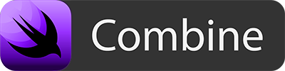

# 100 Days of SwiftUI

_Projects, playgrounds, and other material made while following along with [Paul Hudson’s 100 Days of SwiftUI course](https://www.hackingwithswift.com/100/swiftui)._

If you're just getting started with SwiftUI, I'd recommend the [About SwiftUI](https://github.com/Juanpe/About-SwiftUI) repo as a reference of all the different learning resources out there. Hopefully, though, this repo can offer some helpful examples, too.

For each day that proves conducive to some kind of code or content, I'll make a standalone folder and link to it below. I'll also make a section for any standalone projects that span multiple days so those can be found directly.

Cheers! ✌️

## Days

Full List

- **Days 1-15:** Introduction to Swift (Covered during the [100 Days of Swift](https://github.com/CypherPoet/100-days-of-swift) challenge.)
- **Day 16:** [_Project 1: WeSplit_ (Part One)](./day-016/)
- **Day 17:** [_Project 1: WeSplit_ (Part Two)](./day-017/)
- **Day 18:** [_Project 1: WeSplit_ (Part Three)](./day-018/)
- **Day 19:** [Challenge Day](./day-019/)
- **Day 20:** [_Project 2: Guess The Flag_ (Part One)](./day-020/)
- **Day 21:** [_Project 2: Guess The Flag_ (Part Two)](./day-021/)
- **Day 22:** [_Project 2: Guess The Flag_ (Part Three)](./day-022/)
- **Day 23:** [_Project 3: Views and Modifiers_ (Part One)](./day-023/)
- **Day 24:** [_Project 3: Views and Modifiers_ (Part Two)](./day-024/)
- **Day 25:** [Milestone for Projects 1-3](./day-025/)
- **Day 26:** [_Project 4: BetterRest_ (Part One)](./day-026/)
- **Day 27:** [_Project 4: BetterRest_ (Part Two)](./day-027/)
- **Day 28:** [_Project 4: BetterRest_ (Part Three)](./day-028/)
- **Day 29:** [_Project 5: WordScramble_ (Part One)](./day-029/)
- **Day 30:** [_Project 5: WordScramble_ (Part Two)](./day-030/)
- **Day 31:** [_Project 5: WordScramble_ (Part Three)](./day-031/)
- **Day 32:** [_Project 6: Animation_ (Part One)](./day-032/)
- **Day 33:** [_Project 6: Animation_ (Part Two)](./day-033/)

- **Day 34:** [_Project 6: Animation_ (Part Three)](./day-034/)

## Projects

- [Project 1: WeSplit](./day-016/projects/WeSplit)

  

- [Challenge 1: Unit Conversion App](./day-019/TheBestConverter/)

  

- [Project 2: GuessTheFlag](./day-020/projects/GuessTheFlag)

  

- [Milestone 1: RockPaperQuizzers](./day-019/TheBestConverter/)

  

- [Project 4: BetterRest](./day-026/projects/BetterRest)

  

- [Project 5: WordScramble](./day-029/projects/WordScramble)

  

- [Project 6: Animation](./day-32/Projects/AnimationSandbox)

  

