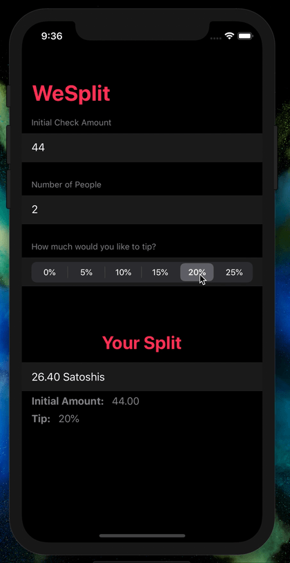

# Day 24: _Project 3: Views and Modifiers_ (Part Two)

_Follow along at https://www.hackingwithswift.com/100/swiftui/24_.

# 📒 Field Notes

This day covers Part Two of _`Project 3: Views and Modifiers`_ in the [100 Days of SwiftUI Challenge](https://www.hackingwithswift.com/100/swiftui/24). (Project 3 files can be found in the [directory for Part One](../day-023/).)

In addition to recapping the material covered during the project's other days, Day 24 focuses on extending the project according to a set of challenges.

# 🥅 Challenges

## Challenge 1

> Create a custom `ViewModifier` (and accompanying `View` extension) that makes a view have a large, blue font suitable for prominent titles in a view.

- 🔗 [Commit](https://github.com/CypherPoet/100-days-of-swiftui/commit/d41dd2e1304a489311e59f996c1d8425d8292b8d)

## Challenge 2

> Go back to project 1 and use a conditional modifier to change the total amount text view to red if the user selects a 0% tip.

- 🔗 [Commit](https://github.com/CypherPoet/100-days-of-swiftui/commit/6d78fb2b0df155de817ade33d7bffb49d72922f9)

## Challenge 3

> Go back to project 2 and create a `FlagImage()` view that renders one flag image using the specific set of modifiers we had.

- 🔗 [Commit](https://github.com/CypherPoet/100-days-of-swiftui/commit/71fffea0f3c492aac18c7344f9aad9b2c64ff597)

# 📸 Screenshots

  

