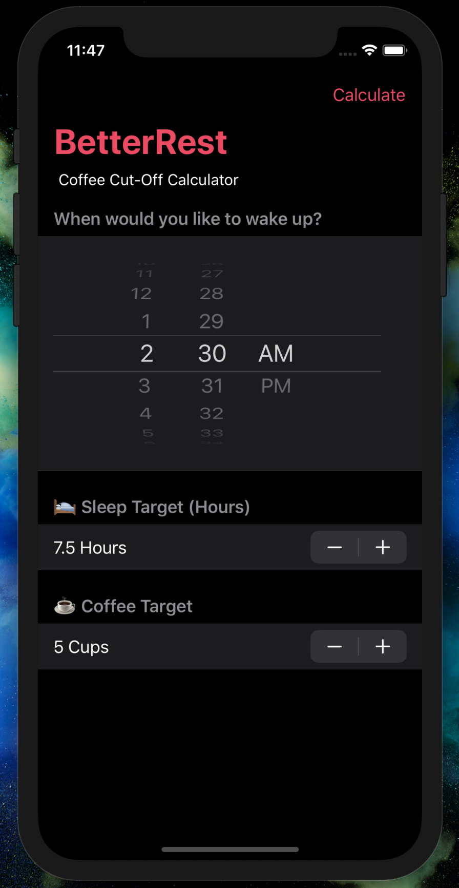

# Day 27: _Project 4: BetterRest_ (Part Two)

_Follow along at https://www.hackingwithswift.com/100/swiftui/27_.


# 📒 Field Notes

This day covers Part Two of _`Project 4: BetterRest`_ in the [100 Days of SwiftUI Challenge](https://www.hackingwithswift.com/100/swiftui/27). (Project 4 files can be found in the [directory for Part One](../day-026/).)

It focuses on several specific topics:

- Building a basic layout
- Connecting SwiftUI to Core ML
- Cleaning up the user interface


## Building a basic layout

Rendering the `DatePickers` label directly can be a bit visually awkward. I wrote up an article
recently on [a solution I tend to prefer instead](https://theswiftness.com/swiftui-rendering-a-datepicker-without-its-default-label/), which includes rendering the label as a separate `Text` element above the picker.

```swift
VStack {
    Text("When do you want to wake up?")
        .font(.headline)

    DatePicker("Please enter a time", selection: $wakeUp, displayedComponents: .hourAndMinute)
        .labelsHidden()

    // more to come
}
```

## Connecting SwiftUI to Core ML

Dragging an output CreateML model into our Xcode project will generate a Swift class
with the same name (in camel-case).

Through this model, we're given a `prediction` function that can take whatever features
it's parameterized on and generate a value for the result that it's trained to predict. That's [really just scratching the surface](https://developer.apple.com/documentation/createml/creating_a_model_from_tabular_data), but it's perfect for our app's coffee cut-off time prediction.


## Cleaning up the user interface

Lookin' alright...


<div style="text-align: center;">
  
</div>


