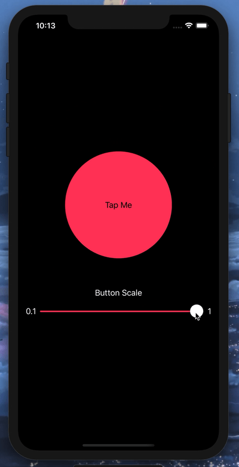

# Day 32: _Project 6: Animation_ (Part One)

_Follow along at https://www.hackingwithswift.com/100/swiftui/32_.

# 📒 Field Notes

This day covers Part One of _`Project 6: Animation`_ in the [100 Days of SwiftUI Challenge](https://www.hackingwithswift.com/100/swiftui/32).

It focuses on several specific topics:

- Animation: Introduction
- Creating implicit animations
- Customizing animations in SwiftUI
- Animating bindings
- Creating explicit animations

## Animation: Introduction

From the description:

> In this technique project we’re going to look at a range of animations and transitions with SwiftUI.

## Creating implicit animations

With the `.animation()` modifier, we can essentially place a "hook" into our composed view that tells SwiftUI to animate any animatable properties of this view declared _above_ the modifier. Pretty handy.

## Customizing animations in SwiftUI

The spirit of an animation lies in its easing function. Fortunately, SwiftUI gives us plenty of tools to craft easing functions in the argument that we pass to `.animation.`

## Animating bindings

SwiftUI animates by drawing a series of views that "interpolate" between the animation start and end state within a specified duration.

Naturally, this built-in view drawing is a perfect match for reactive view bindings.

# 📸 Screenshots

  

# 🔗 Additional Related Links

- One of My Favorite Books: _[The Animator's Survival Kit](http://www.theanimatorssurvivalkit.com/)_
- [Playing with SwiftUI Buttons](https://alejandromp.com/blog/2019/06/09/playing-with-swiftui-buttons/)
