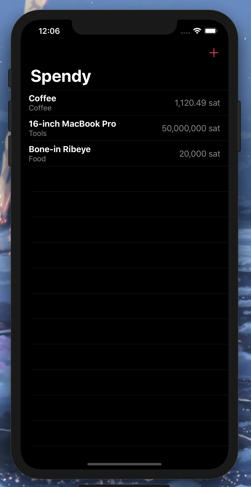

# Day 37: _Project 7: iExpense_ (Part Two)

_Follow along at https://www.hackingwithswift.com/100/swiftui/37_.

# 📒 Field Notes

This day covers Part Two of _`Project 7: iExpense`_ in the [100 Days of SwiftUI Challenge](https://www.hackingwithswift.com/100/swiftui/37). (Project 7 files can be found in the [directory for Part One](../day-036/).)

It focuses on several specific topics:

- Building a list we can delete from
- Working with Identifiable items in SwiftUI
- Sharing an observed object with a new view
- Making changes permanent with UserDefaults
- Final polish

The commit for the project changes to go along with this day can be found [here](https://github.com/CypherPoet/100-days-of-swiftui/commit/38096633d3f8bcbaa2dcd95265369e62ee2f0ed8).

# 📸 Screenshots

  

