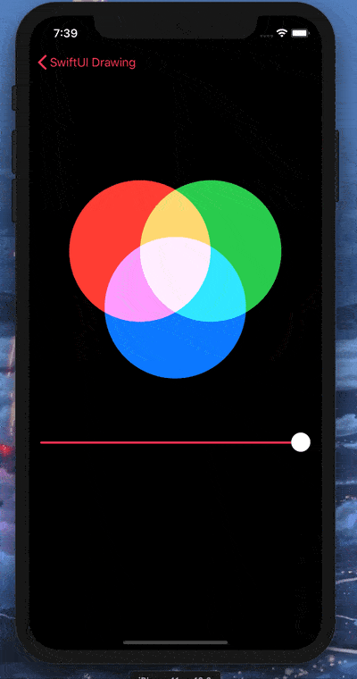
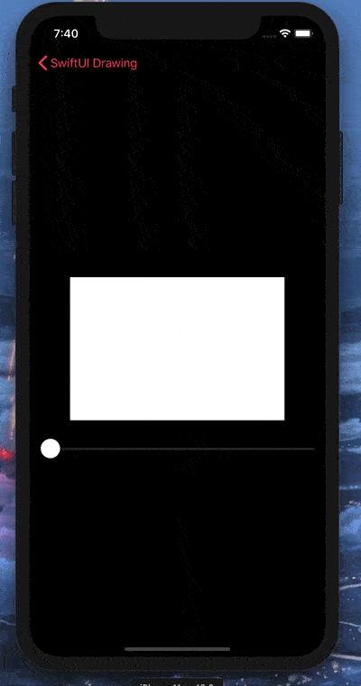

# Day 45: _Project 9: Drawing_ (Part Three)

_Follow along at https://www.hackingwithswift.com/100/swiftui/45_.

 

# 📒 Field Notes

This day covers Part Three of _`Project 9: Drawing`_ in the [100 Days of SwiftUI Challenge](https://www.hackingwithswift.com/100/swiftui/45). (Project 9 files can be found in the [directory for Part One](../day-043/).)

It focuses on several specific topics:

- Special effects in SwiftUI: blurs, blending, and more
- Animating simple shapes with animatableData
- Animating complex shapes with AnimatablePair
- Creating a spirograph with SwiftUI

## Special effects in SwiftUI: blurs, blending, and more

  

  

## Animating simple shapes with animatableData

  

## Animating complex shapes with AnimatablePair

  

## Creating a spirograph with SwiftUI

  

