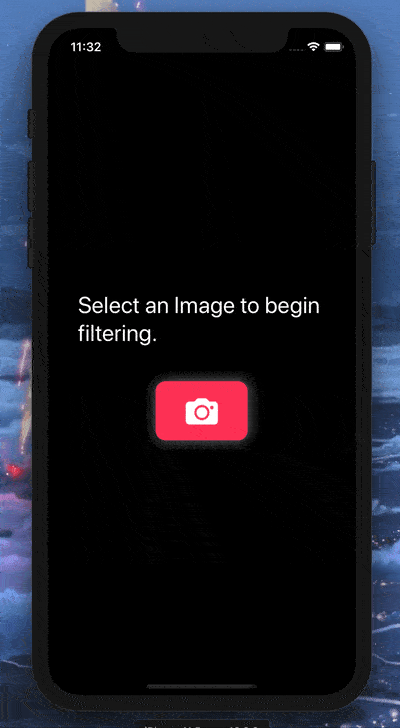

# Day 63: _Project 13: Instafilter_ (Part Two)

_Follow along at https://www.hackingwithswift.com/100/swiftui/63_.

 

# 📒 Field Notes

This day covers Part Two of _`Project 13: Instafilter`_ in the [100 Days of SwiftUI Challenge](https://www.hackingwithswift.com/100/swiftui/63). (Project 13 files can be found in the [directory for Part One](../day-062/).)

It focuses on several specific topics:

- Integrating Core Image with SwiftUI
- Wrapping a UIViewController in a SwiftUI view

  

 
