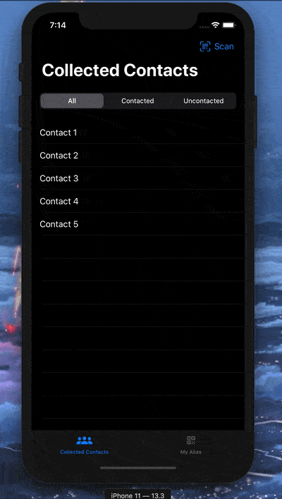

# Day 82: _Project 16: QRConnections_ (Part Four)

_Follow along at https://www.hackingwithswift.com/100/swiftui/82_.

 

# 📒 Field Notes

This day covers Part Four of _`Project 16`_ in the [100 Days of SwiftUI Challenge](https://www.hackingwithswift.com/100/swiftui/82). (Project 16 files can be found in the [directory for Part One](../day-079/).)

It focuses on several specific topics:

- Building our tab bar
- Sharing data across tabs using @EnvironmentObject
- Dynamically filtering a SwiftUI List

## Building our tab bar

From the project description:

> This app is going to display four SwiftUI views inside a tab bar: one to show everyone that you met, one to show people you have contacted, another to show people you haven’t contacted, and a final one showing your information for others to scan.

Given that I tend to tabs as [organizing application categories](https://developer.apple.com/design/human-interface-guidelines/ios/bars/tab-bars/), I took a slightly different approach by only making two: A tab for our collected contacts and a tab for the user's own QR Code.

Filtering, then, can be facilitated by a segmented picker:

  

